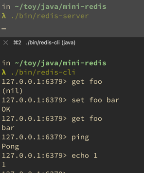

# mini-redis

以重新实现的方式学习 redis 设计与实现。

基础版本，参考 redis 2.2.0

- resp2 协议可用- cli, aof , replication 使用的都是 resp2 协议
- rdb, aof 可用
- 足够多的类型和命令支持

## 目标

与 redis 2.2.0 对等

- 协议 resp2
- 主从，从主
- RDB 兼容
- AOF 兼容

## 进展

- [x] file event loop
- [ ] time event schedule
- [x] ping & echo
- [x] get & set
- [ ] rdb
  - save
  - bgsave
- [ ] aof
  - rewrite
  - bgrewrite
- [ ] replication
  - sync
  - slaveof
- [ ] expire & ttl
  - expire
  - ttl
  - persist
  - setex

## 运行

编译

```bash
# 编译
mvn clean package
```

运行 server

```bash
./bin/redis-server
```

运行 cli , 或者 telnet

```bash
./bin/redis-cli
```

## 示例




## 参考

- [redis 源码](https://github.com/redis/redis)
- [redis 文档](https://redis.io)
